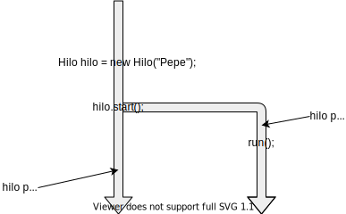
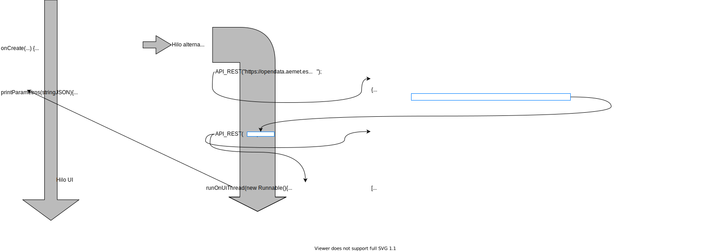

<h3 align="center">Aplicaciones y Usabilidad</h3>


<h1 align="center"><b>JSON y servicios web en Android</b></h1>
<h3 align="center"><b>Práctica 9</b></h3>

<h4 align="center"><b>Maritza Elizabeth Palacios Morocho</b><br><b>Ángel Alcaraz Bellido</b><br><b>P. Beneit Mayordomo</b></br>
<b>F. J. Martínez Zaldívar</b></h4>

<h3 align="center">Grado en Tecnología Digital y Multimedia</h3>
<h3 align="center">ETSIT-UPV</h3>

# 1. Introducción y objetivos

Los servicios web son utilizados hoy en día en gran cantidad de
aplicaciones. En la presente práctica nos planteamos como objetivos ser
capaces de, empleando el entorno de programación de Android, utilizar
estos servicios elaborando peticiones de tipo API REST, recibir los
resultados y extraer de los mismos la información en la que estemos
interesados.

Para ello, utilizaremos un ejemplo de entre los múltiples que podemos
encontrar en la red: el servicio OpenData de AEMET, la Agencia Estatal
de Meteorología. Pediremos la predicción meteorológica para ciertos
intervalos o instantes horarios de un municipio en concreto y
extraeremos ciertas propiedades de dicha predicción, escribiéndolas en
pantalla.

Esta práctica está basada en una anterior en la que se realizaba estos
mismos procesos pero en el entorno de Java ejecutado en un PC. Veremos
que aunque la mecánica es la misma, existen matices que van a
diferenciar sutilmente una práctica de otra.

Los denominadores comunes son:

- Utilización de servicios web: creación de petición API-REST y
    recolección de resultados.

- Empleo de certificados digitales

- Manipulación de objetos y arrays JSON

Respecto a las diferencias, utilizaremos una clase distinta en Android para manejar los objetos y arrays JSON, así como otra para realizar las peticiones http. El acceso a un recurso que pueda implicar un tiempo de respuesta potencialmente largo (como una petición http) requiere en Android realizar dicho acceso en un hilo de ejecución distinto al de la interfaz de usuario, por lo que en esta práctica, a diferencia de la realizada con Java, obligatoriamente tendremos que trabajar con *hilos*.

## 1.1. Formación de grupos

Los grupos para realizar esta práctica serán de uno o dos alumnos,
intentando mantener los de la práctica anterior. Si por algún motivo
hubiera algún cambio, éste debe comunicarse al profesorado. Se sugiere
que se lean detenidamente todas las indicaciones dadas en la presente
memoria para poder llevar hasta el final la realización de esta
práctica.

## 1.2. Hardware&#x2014;software necesario y comunicaciones

El hardware y software necesario consistirá en:

- Ordenador personal de cualquier arquitectura: Windows, OS-X o Linux

- IDE Android Studio

- Capacidad de virtualización de procesadores activada o terminal
    Android real

Respecto a comunicaciones será necesario tener evidentemente conexión a
Internet.

## 1.3. Clonación del presente repositorio

El presente repositorio contiene un proyecto Android que es directamente clonable desde el propio Android Studio utilizando las herramientas gráficas a tal efecto que contiene el IDE. De manera alternativa se puede clonar desde línea de comandos utilizando los comandos **git** oportunos y posteriormente abrir el proyecto localmente desde Android Studio.

# 2. Acceso al servicio web AEMET OpenData

Aquí hacemos referencia a la sección "Servicio AEMET OpenData" de la
práctica 7 de APLICUSA, siendo completamente válidos los aspectos allí
comentados.

En el contexto de Android no tenemos disponible la clase `OkHttpClient`
para acceder a los servicios web de AEMET, luego tendremos que emplear
alguna clase alternativa con la que consigamos los mismos objetivos. Una
alternativa es `HttpURLConnection`. Un pequeño ejemplo de uso de esta
clase se muestra a continuación en forma de método o función que, a
partir de una URL introducida como un parámetro de la clase `String` en
la llamada, devuelve un `String` con el resultado de la petición
API-REST. Se sugiere que se entienda perfectamente el funcionamiento del
siguiente código o *snippet* y que se utilice oportunamente en la
solución.

```java
/** La petición del argumento es recogida y devuelta por el método API_REST.
    Si hay algún problema se retorna null */
public String API_REST(String uri) {
    
    StringBuffer response = null;

    try  {
        URL url = new URL(uri);
        Log.d(TAG, "URL: " + uri);
        HttpURLConnection conn = (HttpURLConnection) url.openConnection();
        // Detalles de HTTP
        conn.setReadTimeout(15000);
        conn.setConnectTimeout(15000);
        conn.setRequestMethod("GET");

        int responseCode = conn.getResponseCode();
        Log.d(TAG, "Código de respuesta: " + responseCode);
        if (responseCode == HttpsURLConnection.HTTP_OK) {
            BufferedReader in = new BufferedReader(new InputStreamReader(conn.getInputStream()));
            String output;
            response = new StringBuffer();

            while ((output = in.readLine()) != null) {
                response.append(output);
            }
            in.close();
        } else {
            Log.d(TAG, "responseCode: " + responseCode);
            return null; // retorna null anticipadamente si hay algún problema
        }
    } catch(Exception e) { 
        // Posibles excepciones: MalformedURLException, IOException y ProtocolException
        e.printStackTrace();
        Log.d(TAG, "Error conexión HTTP:" + e.toString());
        return null; // retorna null anticipadamente si hay algún problema
    }

    return new String(response); // de StringBuffer -response- pasamos a String

} // API_REST
```

A partir de aquí, habría que realizar el oportuno análisis JSON y
extraer las propiedades en las que estamos interesados. Recuérdese de la
práctica de AEMET realizada con Java en un PC, que habrá que efectuar
dos llamadas encadenadas para obtener el JSON final.

# 3 JSON y el paquete `org.json` de Java en Android

De la misma forma que ocurría con el paquete `okhttp3`, el paquete
`javax.json` no lo vamos a encontrar en Android. Alternativamente, el
paquete de Android `org.json` puede cumplir perfectamente su cometido,
teniendo una funcionalidad similar, aunque con algunas diferencias, a la
del citado y ya conocido paquete `javax.json`.

Por ejemplo, podemos crear directamente un array u objeto JSON a partir
del string que lo representa con:

```java
JSONArray array = new JSONArray(string_JSON_Array);
```

o bien

```java
JSONObject objeto = new JSONObject(string_JSON_Object);
```

A partir de un `JSONArray` o `JSONObject`, pueden extraerse objetos,
arrays, strings, enteros, booleanos, etc.:

- Objetos: `.getJSONObject(selector)`

- Arrays: `.getJSONArray(selector)`

- Enteros: `.getInt(selector)`

- Strings: `.getString(selector)`

- Booleanos: `.getBoolean(selector)`

- ...

donde `selector` hace referencia a un entero (índice), si estamos accediendo a un
elemento de un array o a un *string* si estamos accediendo a una propiedad
de un objeto. Se sugiere que se busque documentación en Internet para conocer algún detalle o ejemplo de funcionamiento.

# 4. Instalación de certificados digitales

Tal y como ocurría con la práctica de AEMET con Java en un PC, será
necesario que el certificado digital (o la cadena oportuna de
certificados digitales) esté instalado en algún tipo de almacén al que
acuda el sistema cuando se pretenda acceder a un recurso web mediante el
protocolo `https`, lo cual es el caso. En la práctica anterior,
descargamos y formamos este almacén. En esta, muy probablemente
tendremos ya instalado de manera correcta el certificado necesario en el
almacén propio de Android, por lo que no habrá que hacer nada.

Para verificar si efectivamente el certificado está instalado o no,
tanto si se va a utilizar el terminal virtual de Android, como si el
terminal es real, el certificado debería encontrarse en: Configuración
del sistema (Settings) &#x2192; Seguridad y ubicación (Security and
Location) &#x2192; (Advanced) &#x2192; Cifrado y Credenciales
(Encryption and credentials) &#x2192; Certificados de confianza
(Trusted credentials) &#x2192; y definitivamente, deberíamos poder
encontrar el certificado ACCVRAIZ1 de ACCV (incluso deberíamos poder
activarlo o desactivarlo por si pudiera estar comprometido, o por si por
algún motivo no deseáramos considerarlo).

Si efectivamente, así lo encontramos, lo tenemos ya perfectamente
preparado para que todo funcione; si no lo encontramos, deberemos ir a
la página web de ACCV (`https://www.accv.es`, tal y como se hizo en la
práctica 2) e instalar, esta vez, de manera directa el certificado en
nuestro terminal móvil &#x2014;sin necesidad de crear ningún almacén&#x2014;,
siguiendo las indicaciones que se muestran al clicar sobre el
certificado descargado en nuestro terminal Android.

# 5. Clase `Thread`

## 5.1. Ejemplos

La clase `Thread` de Java me permite, al extenderla, crear hilos de ejecución en los cuales ejecutar nuestro código de manera paralela al que podríamos considerar como hilo principal. Esto puede realizarse de múltiples formas. Veamos algún ejemplo:

```java
class Hilo extends Thread {
  
  String nombre;  
  
  Hilo(String nombre) { // constructor
      this.nombre = nombre;
  }
  
  @Override public void run() {
      // Ejecución de código en hilo paralelo
  } // run

} // Hilo


...


class EjemploHilo {

   public static void main(String [] args) {
       Hilo hilo = new Hilo("Pepe");  // creación del objeto de la clase Hilo
       hilo.start();  // ejecución del método run a través de start.
   } // main

} // EjemploHilo
```

lo cual podemos observar en la [figura 1](#fig:thread)

<div id="fig:thread">
<p align="center"><br/>

</p>
<p align="center"><b>Figura 1</b>: creación de un hilo paralelo</p><br/>
</div>

Pueden plantearse otras alternativas más *compactas*, por ejemplo empleando la interfaz `Runnable` y utilizando clases anónimas:

```java

class EjemploHilo2 {

   public static void main(String [] args) {

       new Thread(new Runnable(){
           @Override public run () { // Esto se ejecuta ya en el hilo alternativo
               // Código en hilo alternativo
           }
       }).start();
       
   } // main

} // EjemploHilo2

```

En cualquier caso se obtienen idénticos resultados ([figura 1](#fig:thread)).

En Android, el hilo que podemos considerar como *principal* es el hilo en el que se realizan todas las operaciones e interacciones con la interfaz gráfica; a dicho hilo
*principal* también se le denomina hilo de la *interfaz gráfica* o hilo de la UI (*User Interface*).
En ocasiones, aunque pueda resultar paradójico, estando en un hilo alternativo al principal, puede interesar realizar alguna tarea que se ejecute en el hilo principal o de la UI, por ejemplo alguna actualización de la misma (actualizar un texto, un gráfico...). Android dispone de herramientas para ello, como por ejemplo la utilización del método `runOnUiThread` perteneciente a la clase `Activity` cuyo método `run` es ejecutado en el hilo de la interfaz de usuario (UI), se ejecute `runOnUiThread` donde se ejecute. Por ejemplo:

```java
class EjemploHilo3 {

   TextView texto;

   public static void main(String [] args) {

       texto = (TextView) findViewById(R.id......);
       texto.setText("Contenido de texto"); // esto se ha ejecutado en el hilo de la UI

       new Thread(new Runnable(){
           @Override public run () { // esto ya se ejecuta en el hilo alternativo
               
               // Código en hilo alternativo
               
               String saludo = "hola";

               runOnUiThread(new Runnable() {  // seguimos en un hilo alternativo distinto al principal (UI)
                   @Override public run() {
                     texto.setText(saludo);  // esto se ejecuta ya en el hilo asociado a la UI
                   } // run
                } // Runnable
               ); // runOnUiThread

           }
       }).start();
       
   } // main

} // EjemploHilo2
```

Si intentáramos interactuar con la UI (como en el ejemplo anterior, actualizando un `TextView`) desde un hilo distinto al hilo de la UI o hilo principal, se produciría un error en tiempo de ejecución.

## 5.2. Procesos temporalmente costosos en Android

Hay un problema añadido que todavía no hemos considerado: la petición
HTTP(S) no debemos ponerla en el mismo hilo de ejecución que el hilo en
el que se está ejecutando la interfaz gráfica con el usuario (UI: User Interface), ya que el
tiempo de respuesta del servidor puede ser relativamente largo, y si
tenemos bloqueada la ejecución de dicho hilo, mientras tanto, el móvil
no podría atender a ninguna interacción que el usuario hiciera, por lo
que aparecerá como bloqueado. Ello implica que será necesario realizar
dicha petición HTTP en un hilo distinto al que se ejecuta la UI. Existen numerosas soluciones para ello, proponiendo emplear hilos extendiendo la clase `Thread`.

En la [figura 2](#fig:hilos) se muestra el funcionamiento simbólico de la aplicación
Android:

<div id="fig:hilos">
<p align="center"><br/>

</p>
<p align="center"><b>Figura 2</b>: hilo alternativo al de la UI</p><br/>
</div>

Un resumen de los detalles más importantes a tener en cuenta en la ejecución del hilo alternativo es el siguiente:

- Hay que realizar, tal y como se hizo con la práctica de AEMET con Java de escritorio, dos peticiones HTTPS, esperando sendos resultados JSON.

- Sugerencia: creese una clase que extienda a la clase `Thread` donde se ejecuten las peticiones (o bien créese una clase anónima donde se realicen los procesos requeridos).

- En cualquier caso, arránquese el hilo alternativo desde `onCreate()`.

- Realícense las dos peticiones (método `API_REST(...)` ya proporcionado) HTTPS encadenadas y tras la segunda, invóquese a `runOnUiThread(...)` para escribir los resultados, esta vez, en el hilo de la UI, tal y como se indica en la [figura 2](fig:hilos).

- Complétese el método que escribe los resultados en pantalla.

Se ha proporcionado una plantilla del proyecto con cierta estructura inicial para que el grupo pueda abordar fácil y rápidamente los objetivos de la práctica.

# 6. Otros detalles importantes

## 6.1. Permisos

Si el código estuviera ya finalizado y en este instante se ejecutara,
muy probablemente no funcionaría a no ser que hubiéramos tenido en
cuenta un detalle importante: hay que acceder a Internet y para ello la
aplicación *debe pedir permiso* para ello. Para solucionar este problema
se sugiere que se busque la solución en la documentación de Android;
para ello, se tendrá que modificar el fichero `AndroidManifest.xml`
añadiendo oportunamente cierto elemento XML.

## 6.2. Tratamiento y control de errores

Las principales fuentes de error que podemos encontrarnos en nuestra
aplicación son, por una parte, por un código de respuesta del protocolo
HTTP que diera lugar a un error, lo cual podría controlarse en la
sentencia `else` de la rutina anterior `API_REST`:

```java
if (responseCode == HttpsURLConnection.HTTP_OK) \{
   ...
} else {
   Log.d(TAG, "responseCode: " + responseCode);
   return null; // retorna null anticipadamente si hay algún problema
}
```

por otra, por alguna excepción como `MalformedURLException`,
`IOException` y `ProtocolException`, lo cual es controlable en el bloque
`catch` del mismo método:

```java
} catch(Exception e) { 
    // Posibles excepciones: MalformedURLException, IOException y ProtocolException
    e.printStackTrace();
    Log.d(TAG, "Error conexión HTTP:" + e.toString());
    return null; // retorna null anticipadamente si hay algún problema
}
```

En cualquier caso, el denominador común que se ha adoptado es que la
rutina finaliza y retorna un `null`.

Si ocurre esta situación, la intención es generar un `Toast` o pequeña
advertencia o mensaje temporal que suele aparecer en la parte inferior
de la pantalla. Puede conseguirse con la siguiente instrucción:

```java
Toast.makeText( getApplicationContext(), "Problemas en el servicio web de AEMET", 
                Toast.LENGTH_LONG ).show();
```

Ya que está íntimamente relacionado con la UI, esta llamada se debe
efectuar en el hilo de la UI usando, por ejemplo, `runOnUiThread` tal y como se describió en subapartados anteriores &#x2014;cuando el *string*
`respuesta` fuera `null`&#x2014;.

Por último, también puede ocurrir una excepción al decodificar la
respuesta JSON con la excepción `JSONException`, debiendo *cazarla* allá
donde sea oportuno.

# 7. Desarrollo de la práctica

Un resumen de las acciones a realizar puede ser el siguiente:

- Clónese el repositorio desde `Android Studio`.

- En el directorio clonado aparecerá el presente fichero denominado `README.md`

- Recuérdese los detalles del funcionamiento de las API de AEMET
    OpenData

- Verifíquese la instalación del certificado raíz de ACCV

- Complétese el fichero `MainActivity.java` del proyecto Android,
    siguiendo las indicaciones que aparecen en el propio fichero y las
    dadas en la presente memoria

- Complétese el fichero de recursos `activity_main.xml` del proyecto
    Android con los elementos `View` oportunos para indicar las
    magnitudes y los valores meteorológicos exigidos:

- Gestiónese el permiso de acceso a Internet oportunamente

- Obténgase la predicción meteorológica siguiente:

  - Temperatura (a las 18 h &#x2014;intervalo 12&#x2013;18 h&#x2014;)

  - Probabilidad de precipitación en tanto por cien entre las 12 y
    las 18 h

  - Dirección y velocidad del viento entre las 12 y las 18 h

  - Estado del cielo entre las 12 y las 18 h

- ...en alguna de las siguientes poblaciones de España:

  - Peleas de Abajo, provincia de Zamora.

  - Guarromán, provincia de Jaén

  - Malcocinado, provincia de Badajoz

Deben contrastarse los resultados con los obtenidos visualmente de
manera directa de la página web de AEMET.


# 8. Resultados a entregar

Debe actualizarse el proyecto Android del repositorio local en el remoto de GitHub. Esto puede llevarse a cabo mediante las herramientas gráficas de apoyo a git que contiene Android Studio, o de manera convencional, en cualquier terminal tal y como se ha ido haciendo hasta ahora; terminal por cierto, que puede ser el que nos proporciona el propio Android Studio. Recuérdese que en cualquier caso, la mecánica consistía en añadir al *index* aquellos ficheros que se desee que formen parte del siguiente commit:

```bash
git add -A // se añadirían todos los ficheros nuevos, modificados y borrados de todo el directorio de trabajo
```

Creación de un commit:

```bash
git commit -m "Mensaje"
```

Esta operación add-commit puede realizarse cuantas veces lo considere oportuno cada integrante del grupo.

Se sugiere que se vayan realizando  regularmente *commits* para ir guardando en el
repositorio local las instantáneas del directorio de trabajo que os
parezcan oportunas, así como realizar una sincronización del repositorio
local con el remoto en GitHub, para salvaguardar una copia de seguridad
del repositorio en la nube; si se usaron nombres *estándar* para servidores y ramas una posibilidad es:

```bash
git push origin master
```

A lo largo del desarrollo de la práctica, el grupo es completamente
libre de actualizar el repositorio local o remoto como lo estime
oportuno, con las ramas o los *commits* que estimen necesarios, pero
respetando los *commits* y *tags* explicitados, como puntos de control. La forma de trabajar
se denomina genéricamente *workflow* y convendría aclararla antes de comenzar, es decir, repartir las tareas y utilizar las herramientas que el propio GitHub proporciona para llevar a cabo la comunicación entre los integrantes del grupo, como las *issues*. Se valorará que haya una intensa interacción con el repositorio remoto.

Si el grupo realiza  consultas a través de las *issues* de GitHub, recuérdese antes,
actualizar el repositorio remoto en GitHub e indicar como *assignees*
tanto al profesor como a todos los integrantes del grupo para que
lleguen notificaciones vía email de que hay una *issue* pendiente de ser
contestada.

## 8.1. Etiquetado

Cada alumno integrante del grupo deberá etiquetar individualmente tanto el último *commit* de su sesión de prácticas como el de la práctica en sí (si queda algún detalle pendiente, dentro de los tres días lectivos siguientes). Las etiquetas tendrán el formato `prN.sesion.fin.<USUARIO_DE_GITHUB>` y `prN.fin.<USUARIO_DE_GITHUB>` respectivamente, siendo `N` el número de la práctica. Estos *commits* deben estar ubicados obligatoriamente en la rama `master`.

Ello puede implicar que si los miembros del grupo hacen la práctica en la misma sesión y la finalizan en dicha sesión, el  *commit* en cuestión tendrá las 4 etiquetas. Si en ese mismo caso, quedan detalles pendientes por finalizar durante los tres siguientes días lectivos, cuando el considerado como último *commit* de la práctica esté en el repositorio, ambos alumnos etiquetarán dicho *commit*, a ser posible en el mismo instante.

Siguiendo con la casuística, si ambos miembros hacen la práctica en días distintos, entonces cada vez que un integrante finalice su sesión de prácticas, etiquetará su último *commit* con `prN.sesion.fin.<USUARIO_DE_GITHUB>`. Cuando se dé la práctica por finalizada en cierto último *commit*, este deberá ser etiquetado por ambos con la etiqueta `prN.fin.<USUARIO_DE_GITHUB>`, a ser posible el mismo día.

Las etiquetas debe ponerlas cada alumno a título individual (un alumno no podrá etiquetar un *commit* por el otro, ya que la autoría de las etiquetas aparece reflejada en el repositorio). Ello obligará a que el alumno en cuestión tenga que tener sincronizado su repositorio local con el remoto en el momento de realizar el etiquetado.

**MUY IMPORTANTE**: se tiende a confundir mensajes de commit con etiquetas. Es decir, cuando se hace un commit, se añade un mensaje:

```bash
git commit -m "Mensaje"
```

`"Mensaje"` **NO** es la etiqueta del commit. Para etiquetar un commit, recuérdese que se debe emplear el comando `tag` oportunamente. Recuérdese que con

```bash
git tag <ETIQUETA> <REFERENCIA>
```

Se etiqueta con el nombre `<ETIQUETA>` el *commit* cuyo hash, *commit* relativo a puntero o hash es `<REFERENCIA>`. Por ejemplo:

```bash
git tag prN.sesion.fin.fjmz-UPV master
```

etiqueta el commit apuntado por el puntero de rama `master` con la etiqueta `prN.sesion.fin.fjmz-UPV`.

Y con

```bash
git push origin --tags
```

se suben exclusivamente las etiquetas al repositorio remoto ubicado en el servidor `origin`.

Recuérdese que Android Studio posee herramientas gráficas para llevar a cabo todos estos procesos de gestión del repositorio  local y remoto. Utilícese el que le resulte más cómodo a los integrantes del grupo.

# 9. Trabajo de asignatura

La ampliación de esta práctica podría considerarse perfectamente como
**trabajo de asignatura**. Entiéndase por ampliación, la posibilidad de,
por ejemplo, seleccionar todos los pueblos de cierta región o incluso de
cualquier región (esto puede conllevar el manejo de cierta cantidad de información importante, concentrarla y hacerla accesible a la aplicación),
o plantear otros casos de servicios dados por AEMET,
mejora de la interfaz gráfica añadiendo figuras para representar el
estado del cielo, la temperatura, etc., o cualquier concepto que el
alumno desee desarrollar.
